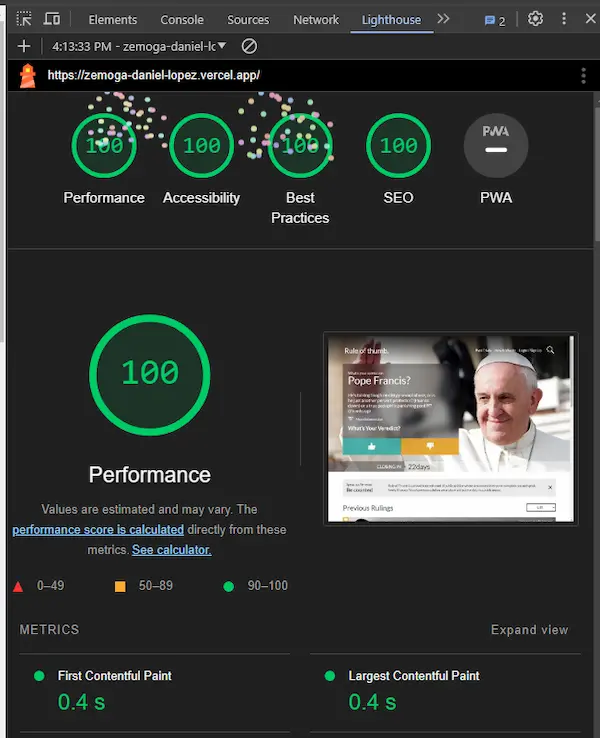

# Zemoga Daniel López


## [Demo](https://zemoga-daniel-lopez.vercel.app/)


## Setup

Is necessary clone the repo  `github`

```
git clone https://github.com/daniellopezj/zemoga-daniel-lopez.git
```

Make sure to install the dependencies:

```bash
npm install
```

## Development Server

Start the development server on `http://localhost:3000`:

```bash
npm run dev
```

## Report lighthouse 🚀




